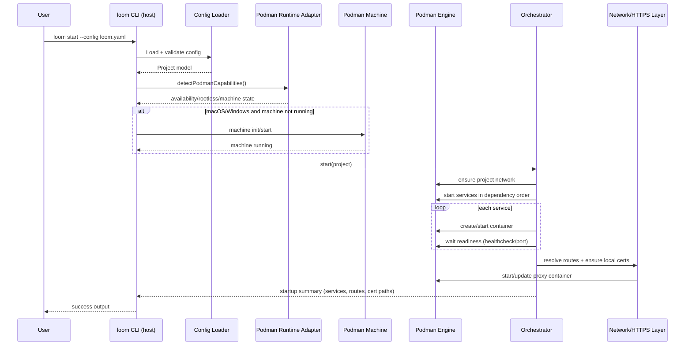

# Loom Technical Architecture

## Goals

- Podman-first local development for Node.js, PHP, and Python applications.
- Cross-platform support on Linux, macOS, and Windows using Podman Machine where required.
- Rootless compatibility by default.
- Native Loom YAML config with optional Compose import.
- Extensible plugin system and build/task automation.

## Core Components

1. **CLI (`@loom/cli`)**
   - User commands (`start`, `status`, `test`, later `stop`, `logs`, `exec`, `plugin`).
   - Config loading and orchestration invocation.

2. **Config (`@loom/config`)**
   - YAML parsing and schema validation.
   - Defaults normalization and config versioning.

3. **Orchestrator (`@loom/core`)**
   - Service graph lifecycle and dependency ordering.
   - Runtime coordination with Podman adapter.
   - Task execution routing.

4. **Podman Runtime (`@loom/runtime-podman`)**
   - Podman capability detection.
   - Rootless guardrails.
   - Podman Machine initialization/start support on macOS/Windows.

5. **Future Packages**
   - `@loom/network`: service networking and DNS abstraction.
   - `@loom/https`: local CA + certificate automation.
   - `@loom/plugin-host` and `@loom/plugin-sdk`: plugin lifecycle and API contracts.

## Runtime Strategy

- Linux: use native rootless Podman as primary path.
- macOS/Windows: use fully managed Podman Machine lifecycle.
- Capability checks happen before lifecycle actions for deterministic diagnostics.

## Runtime Flow Diagram

```mermaid
flowchart LR
   subgraph Host[Host OS: Linux / macOS / Windows]
      CLI[loom CLI (Node.js + pnpm)]
      CFG[loom.yaml + local project files]
      CERTS[.loom/certs + local metadata]
   end

   subgraph Engine[Podman Engine]
      NET[Project network]
      PROXY[caddy route proxy container]
      APP[App service containers]
      DB[Database/cache containers]
   end

   subgraph VM[Podman Machine VM (macOS/Windows only)]
      ENGINEVM[Podman daemon + containers]
   end

   CLI -->|reads| CFG
   CLI -->|manages certs| CERTS
   CLI -->|podman CLI/API calls| Engine
   CLI -->|init/start/inspect| VM
   VM --> ENGINEVM
   ENGINEVM --> Engine

   NET --> PROXY
   NET --> APP
   NET --> DB
   PROXY --> APP
```

## Host vs Machine

- Loom itself runs on the host as a CLI tool.
- Loom does not install itself inside Podman Machine.
- Loom creates and manages containers/networks/proxy inside Podman (native on Linux, inside VM on macOS/Windows).

## `loom start` Sequence



## Build Automation

- Named tasks in `loom.yaml` map to service-scoped commands.
- CLI task runner calls orchestrator and runtime adapter execution APIs.

## Plugin Model (Planned)

- Hook-based lifecycle (`beforeStart`, `afterStart`, `beforeTask`, `afterTask`).
- Versioned API contracts to keep plugin compatibility stable.
- Plugin manifests loaded from project and global plugin directories.
