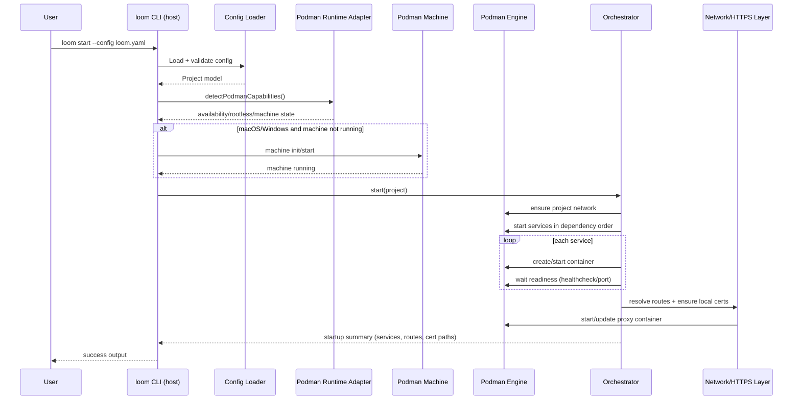

# How Loom Works (User-Friendly)

This page explains what Loom does for you when you run commands, in plain terms.

## What Loom is doing in the background

When you run `loom start`, Loom:

1. Checks Podman is available.
2. Reads your `loom.yaml`.
3. Starts services in the right dependency order.
4. Waits for them to become actually ready.
5. Sets up local route proxy + HTTPS certs if routes are configured.

This is why Loom feels predictable even for bigger stacks.

## Runtime flow diagram

```mermaid
flowchart LR
   subgraph Host[Host OS: Linux / macOS / Windows]
      CLI[loom CLI (Node.js + pnpm)]
      CFG[loom.yaml + local project files]
      CERTS[.loom/certs + local metadata]
   end

   subgraph Engine[Podman Engine]
      NET[Project network]
      PROXY[caddy route proxy container]
      APP[App service containers]
      DB[Database/cache containers]
   end

   subgraph VM[Podman Machine VM (macOS/Windows only)]
      ENGINEVM[Podman daemon + containers]
   end

   CLI -->|reads| CFG
   CLI -->|manages certs| CERTS
   CLI -->|podman CLI/API calls| Engine
   CLI -->|init/start/inspect| VM
   VM --> ENGINEVM
   ENGINEVM --> Engine

   NET --> PROXY
   NET --> APP
   NET --> DB
   PROXY --> APP
```

## Host vs Podman Machine (simple explanation)

- Loom runs as a CLI on your computer.
- On Linux, Loom talks to Podman directly.
- On macOS/Windows, Loom uses Podman Machine automatically when needed.
- Your app services still run in containers either way.

## `loom start` sequence



## Why this matters for beginners

- Fewer startup surprises.
- Faster onboarding for new projects.
- Same command flow across many stacks.
- Cleaner local environments with one stop command.

## Internal module boundaries

The main runtime and orchestration packages are now split into smaller modules so behavior can be tested without changing the public package APIs.

### `@loom/core`

- `src/index.ts` is the public orchestrator facade.
- `src/runtime.ts` handles runtime readiness checks.
- `src/service-start.ts` handles per-service startup and readiness.
- `src/routes.ts` handles route resolution, HTTPS cert selection, proxy startup, and startup summaries.
- `src/backup.ts` handles backup support checks, path resolution, and backup orchestration.
- `src/status.ts`, `src/services.ts`, `src/tasks.ts`, `src/startup.ts`, and `src/lifecycle.ts` hold status assembly, validated lookups, formatting, and stop-flow logic.

### `@loom/runtime-podman`

- `src/podman.ts` owns low-level Podman command execution.
- `src/containers.ts` owns container metadata and run-argument helpers.
- `src/lifecycle.ts` owns container lifecycle, exec, logs, and Composer support.
- `src/readiness.ts` owns readiness probing.
- `src/backup.ts` owns database backup strategy and streaming.
- `src/machine.ts` owns capability detection and machine startup.

### Why the split matters

- Public imports stay stable for CLI and downstream packages.
- Side-effecting boundaries are narrower, which makes tests more direct and less brittle.
- The orchestrator reads as high-level phase sequencing instead of a single large mixed-responsibility file.
