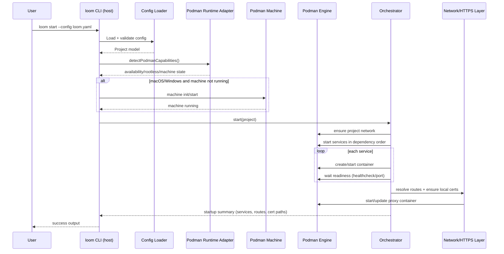

# How Loom Works (User-Friendly)

This page explains what Loom does for you when you run commands, in plain terms.

## Local-first ownership

Loom is a runtime coordinator, not a containerized source-code store.

- Application source, tests, manifests, and lockfiles live in the local project directory. Templates that support local dependency visibility also place dependency directories inside that bind-mounted workspace.
- Service containers provide language runtimes, operating-system libraries, and backing services.
- Loom bind-mounts the local project into each application container, normally under `/workspace` or another stack-specific work directory.
- Processes that write into the project use host-aligned UID/GID mapping where the platform supports it.
- Loom runtime state and development certificates live under the ignored local `.loom/` directory.

This boundary keeps files visible to editors, Git, debuggers, and host command-line tools while retaining a consistent container runtime.

## Project creation and adoption

- `loom init <stack>` creates a new local project from a stack's bundled assets or upstream bootstrap flow.
- `loom adopt [stack]` configures an existing project. With no stack argument, Loom detects common project signals; an explicit stack resolves unsupported or ambiguous layouts.
- Adoption refuses to overwrite an existing `loom.yaml` and does not modify application source, dependency manifests, lockfiles, or an existing `.env.example`.
- Successful initialization and adoption write an upgrade-safe v2 `.loom/manifest.json` with the stack identity, scaffold metadata, render inputs, Loom version, and baselines for files created and owned by Loom.

## Safe configuration upgrades

`loom upgrade` operates only on paths declared as Loom-owned in the project manifest. It renders candidates from the installed Loom release without running a framework generator, then compares each current file with its recorded baseline.

- Missing and baseline-unchanged Loom files are updated automatically.
- Locally modified Loom files are skipped unless `--force-modified` is supplied; skipped files make the command exit with status 1.
- Application source, dependency manifests, lockfiles, `.env`, and unlisted paths are never upgrade targets.
- Successful writes refresh the recorded baselines. Candidate or staging failures leave the prior manifest and baseline metadata intact.
- A v1 manifest is migration-only. `loom upgrade --initialize-baseline` records the current owned files as v2 baselines and exits without replacing project files; a subsequent `loom upgrade` evaluates updates.

The command also accepts `--config <path>` to locate a project outside the current directory. It is non-interactive: replacement of modified Loom-owned files always requires the explicit `--force-modified` flag.

## What Loom is doing in the background

When you run `loom start`, Loom:

1. Checks Podman is available.
2. Reads your `loom.yaml`.
3. Starts services in the right dependency order.
4. Waits for them to become actually ready.
5. Sets up local route proxy + HTTPS certs if routes are configured.

This is why Loom feels predictable even for bigger stacks.

## Runtime flow diagram

```mermaid
flowchart LR
   subgraph Host[Host OS: Linux / macOS / Windows]
      CLI[loom CLI (Node.js + pnpm)]
      CFG[loom.yaml + local project files]
      CERTS[.loom/certs + local metadata]
   end

   subgraph Engine[Podman Engine]
      NET[Project network]
      PROXY[caddy route proxy container]
      APP[App service containers]
      DB[Database/cache containers]
   end

   subgraph VM[Podman Machine VM (macOS/Windows only)]
      ENGINEVM[Podman daemon + containers]
   end

   CLI -->|reads| CFG
   CLI -->|manages certs| CERTS
   CLI -->|podman CLI/API calls| Engine
   CLI -->|init/start/inspect| VM
   VM --> ENGINEVM
   ENGINEVM --> Engine

   NET --> PROXY
   NET --> APP
   NET --> DB
   PROXY --> APP
```

## Host vs Podman Machine (simple explanation)

- Loom runs as a CLI on your computer.
- On Linux, Loom talks to Podman directly.
- On macOS/Windows, Loom uses Podman Machine automatically when needed.
- Your app services still run in containers either way.

## `loom start` sequence

```mermaid
sequenceDiagram
   participant User
   participant CLI as loom CLI (host)
   participant CFG as Config Loader
   participant RT as Podman Runtime Adapter
   participant PM as Podman Machine
   participant PE as Podman Engine
   participant ORCH as Orchestrator
   participant NET as Network/HTTPS Layer

   User->>CLI: loom start --config loom.yaml
   CLI->>CFG: Load + validate config
   CFG-->>CLI: Project model

   CLI->>RT: detectPodmanCapabilities()
   RT-->>CLI: availability/rootless/machine state

   alt macOS/Windows and machine not running
      CLI->>PM: machine init/start
      PM-->>CLI: machine running
   end

   CLI->>ORCH: start(project)
   ORCH->>PE: ensure project network
   ORCH->>PE: start services in dependency order

   loop each service
      ORCH->>PE: create/start container
      ORCH->>PE: wait readiness (healthcheck/port)
   end

   ORCH->>NET: resolve routes + ensure local certs
   NET->>PE: start/update proxy container

   ORCH-->>CLI: startup summary (services, routes, cert paths)
   CLI-->>User: success output
```

## Why this matters for beginners

- Fewer startup surprises.
- Faster onboarding for new projects.
- Same command flow across many stacks.
- Cleaner local environments with one stop command.

## Internal module boundaries

The main runtime and orchestration packages are now split into smaller modules so behavior can be tested without changing the public package APIs.

### `@loom/core`

- `src/index.ts` is the public orchestrator facade.
- `src/runtime.ts` handles runtime readiness checks.
- `src/service-start.ts` handles per-service startup and readiness.
- `src/routes.ts` handles route resolution, HTTPS cert selection, proxy startup, and startup summaries.
- `src/backup.ts` handles backup support checks, path resolution, and backup orchestration.
- `src/status.ts`, `src/services.ts`, `src/tasks.ts`, `src/startup.ts`, and `src/lifecycle.ts` hold status assembly, validated lookups, formatting, and stop-flow logic.

### `@loom/runtime-podman`

- `src/podman.ts` owns low-level Podman command execution.
- `src/containers.ts` owns container metadata and run-argument helpers.
- `src/lifecycle.ts` owns container lifecycle, exec, logs, and Composer support.
- `src/readiness.ts` owns readiness probing.
- `src/backup.ts` owns database backup strategy and streaming.
- `src/machine.ts` owns capability detection and machine startup.

Service definitions can now also opt into Podman user mapping through `user` and `userns: keep-id` when a bind-mounted workspace needs host-aligned write ownership.

## Stack lifecycle direction

The approved local-first design makes new-project generation and existing-project adoption equal workflows. The stack registry, ownership manifest, adoption, and manifest-aware upgrade are available now. Remaining planned capabilities include:

- Pinned, release-tested stack definitions for reproducible `loom init` output.
- `loom doctor` for ownership, runtime, lockfile, port, and compatibility diagnostics.
- `loom clean` for removing only stack-declared generated paths after confirmation.

Pinned generator coverage and the diagnostic and cleanup commands remain planned. The complete approved design is documented in [Local-First Stack Workflows](superpowers/specs/2026-08-17-local-first-stack-workflows-design.md).

### Why the split matters

- Public imports stay stable for CLI and downstream packages.
- Side-effecting boundaries are narrower, which makes tests more direct and less brittle.
- The orchestrator reads as high-level phase sequencing instead of a single large mixed-responsibility file.
